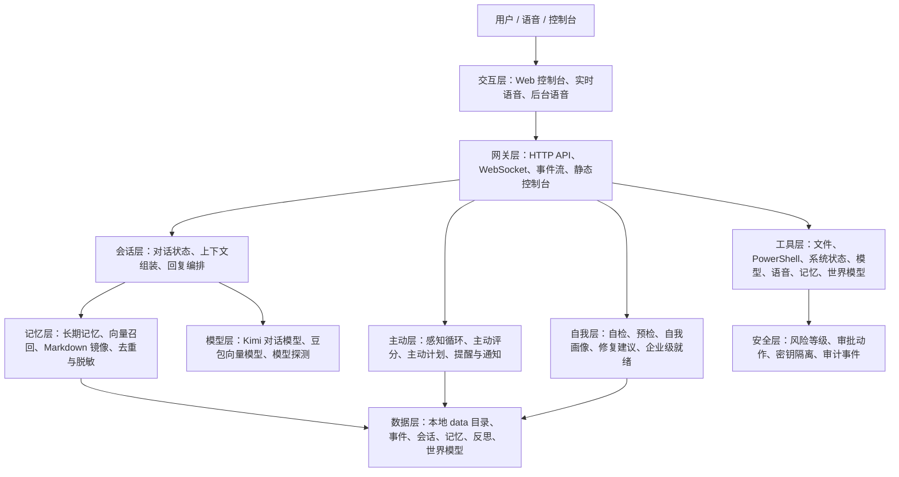

# JARVIS-OS

JARVIS-OS 是一个从零创作的个人 AI 操作层，灵感来自电影里“贾维斯”式的智能助手。它不是一个只负责回答问题的聊天机器人，而是一个运行在个人电脑上的本地智能中枢：可以对话、记忆、感知、主动提醒、调用工具、检查自身状态，并通过语音与用户持续交互。

项目的长期目标，是把“AI 助手”从一个输入框升级成一个始终在线的个人操作系统层。它需要理解你当前在做什么，记住长期偏好和项目状态，判断什么时候应该保持安静，什么时候应该主动提醒，什么时候可以自己准备上下文，什么时候必须向你确认后再行动。

核心循环：

```text
感知 -> 理解 -> 回忆 -> 预测 -> 决策 -> 执行 -> 验证 -> 记忆 -> 改进
```

## 项目定位

JARVIS-OS 的核心不是“问一句答一句”，而是构建一个主动型、记忆驱动、工具可执行、可自检的个人 AI 操作层。

它重点解决四件事：

- 让 AI 长期运行在本机，而不是每次重新开始一段孤立对话。
- 让 AI 能主动理解上下文、主动保存记忆、主动召回相关信息。
- 让 AI 可以通过受控工具真实地操作文件、系统、提醒、通知和本地服务。
- 让 AI 具备系统层面的自我感知、自我诊断、自我修复建议和运行质量检查。

当前版本更接近一个“本地个人智能中枢原型”，已经具备网关、控制台、对话、记忆、向量检索、主动循环、自检、工具调用和语音链路。它不声称拥有真实意识；这里的“自我层”指的是系统级自我建模、自我检查、自我维护和持续改进机制。

## 总体架构



## 分层说明

### 1. 交互层

交互层负责人与 JARVIS-OS 的所有入口。

- Web 控制台：提供本地浏览器控制台、对话窗口、状态面板、工具面板、记忆与系统信息展示。
- 实时语音：浏览器中持续监听麦克风，自动断句，转写后发送给对话系统，再朗读回复。
- 后台语音：通过脚本启动持续语音会话，不依赖浏览器输入框。
- 本地访问：默认运行在 `http://127.0.0.1:31888`，优先面向单机本地使用。

### 2. 网关层

网关层是整个系统的入口和调度中心。

- 提供 HTTP API：对话、记忆、工具、语音、模型、自检、事件、提醒等接口。
- 提供 WebSocket 事件流：把系统事件实时推送到控制台。
- 托管本地控制台：直接从网关服务打开 UI。
- 聚合模块状态：把模型、记忆、语音、工具、主动循环、自我检查等状态统一暴露出去。

### 3. 会话层

会话层负责把一次对话变成可理解、可记忆、可追踪的完整链路。

- 维护会话历史和消息记录。
- 在回复前主动召回相关长期记忆。
- 将系统状态、记忆结果、用户输入和模型配置组合成回复上下文。
- 将重要对话自动送入记忆摄取链路。
- 将对话过程写入事件系统，方便后续回放、诊断和分析。

### 4. 记忆层

记忆层是 JARVIS-OS 区别于普通聊天机器人的核心之一。

- 长期记忆：保存用户偏好、事实、任务、项目状态、经验和重要事件。
- 主动记忆：对话和事件中出现有长期价值的信息，会进入记忆摄取流程。
- 向量召回：使用豆包向量模型把文本转成向量，用于相似度检索。
- Markdown 镜像：把记忆以可读形式同步到本地保险库，方便人工检查。
- 脱敏保护：写入记忆前会进行密钥和敏感内容处理，避免把明显秘密直接沉淀为普通记忆。
- 去重与排序：避免相同内容反复写入，并优先召回更相关、更近期、更重要的记忆。

记忆链路：

```text
用户输入 / 系统事件 -> 记忆摄取 -> 脱敏 -> 分类 -> 向量化 -> 本地保存 -> 对话前主动召回
```

### 5. 模型层

模型层负责对接外部或本地模型能力，并把模型状态暴露给系统其它模块。

- 对话模型：当前面向 Kimi 系列对话模型。
- 向量模型：当前面向豆包向量模型，用于长期记忆检索。
- 模型探测：可以通过接口检查模型链路是否可用、是否配置完整、是否响应正常。
- 路由封装：上层模块不直接关心供应商细节，而是通过模型路由调用。

### 6. 主动层

主动层是 JARVIS-OS 最重要的方向之一：让系统不只被动回答，而是主动观察、判断和准备。

- 感知循环：记录系统事件、服务状态、用户行为线索和当前上下文。
- 主动评分：判断一件事是否重要、紧急、相关、可行动，以及是否会打扰用户。
- 主动计划：决定是静默记录、保存记忆、后台准备、主动提醒，还是需要确认后执行。
- 提醒通知：当事件有价值时生成通知，而不是把所有信息都打扰给用户。
- 安静优先：主动不是“话多”，而是知道什么时候该保持安静。

主动决策层级：

```text
A0 静默观察 -> A1 自动记忆 -> A2 后台准备 -> A3 主动提醒 -> A4 可逆执行 -> A5 确认后执行
```

### 7. 工具层

工具层让 JARVIS-OS 可以连接真实电脑环境，而不是只停留在文本回复。

- 文件工具：搜索、读取、备份文件。
- 系统工具：执行受控 PowerShell 命令、检查服务状态。
- 记忆工具：写入记忆、召回记忆、检查记忆保险库。
- 模型工具：查看模型状态、运行模型探测。
- 语音工具：检查设备、朗读文本、转写音频、测试 TTS。
- 世界模型工具：记录实体、关系、项目、设备和服务。
- 反思工具：记录经验、查找历史反思、沉淀失败和成功模式。

### 8. 安全层

安全层负责让系统“能做事”，但不能失控。

- 风险等级：不同工具和动作被划分为不同风险级别。
- 审批机制：高风险或不可逆动作需要用户确认。
- 密钥隔离：真实密钥只存在本地运行配置中，不进入仓库。
- 审计事件：关键动作会写入事件记录，方便检查发生过什么。
- 备份优先：涉及文件修改时优先提供备份能力。

### 9. 自我层

自我层负责让 JARVIS-OS 知道“自己现在运行得怎么样”。

- 自我画像：记录系统当前能力、配置、模块状态和运行边界。
- 启动预检：检查模型、记忆、工具、语音、配置和服务是否可用。
- 自我诊断：发现模型失败、服务异常、记忆不可用、工具不可用等问题。
- 修复建议：输出下一步修复计划，而不是只报错。
- 企业级就绪：从可靠性、安全性、可观测性、可维护性等角度生成就绪报告。

### 10. 数据层

数据层用于保存本地运行状态。

- 事件：系统运行、工具调用、模型探测、提醒通知等。
- 会话：用户对话和上下文历史。
- 记忆：长期记忆、向量索引和 Markdown 镜像。
- 世界模型：实体、关系、项目、设备、服务。
- 反思：行动结果、经验总结、改进建议。
- 日志：服务运行与检查结果。

本仓库不会提交真实本地数据，`data/` 默认被忽略。

## 核心运行链路

### 对话链路

```text
用户发送消息
-> 网关接收 /chat
-> 会话层读取历史
-> 记忆层主动召回相关长期记忆
-> 模型层生成回复
-> 会话层保存消息
-> 记忆层判断是否需要沉淀新记忆
-> 事件层记录全过程
-> 控制台展示回复
```

### 语音链路

```text
麦克风
-> 浏览器实时录音或后台语音脚本
-> faster-whisper 本地 ASR
-> /chat 对话链路
-> msedge-tts 生成中文语音
-> 扬声器播放
-> 继续监听下一轮
```

### 主动链路

```text
系统事件 / 会话事件 / 模型状态 / 记忆状态
-> 感知循环
-> 主动评分
-> 判断是否打扰用户
-> 静默记录 / 自动记忆 / 后台准备 / 主动提醒 / 等待确认 / 执行动作
-> 验证结果
-> 写入事件与反思
```

### 自检链路

```text
启动或手动检查
-> 检查配置
-> 检查模型
-> 检查记忆
-> 检查语音
-> 检查工具
-> 检查事件与数据目录
-> 生成健康状态和修复建议
```

## 当前已落地能力

### 对话与控制台

- 本地 Web 控制台。
- 本地 HTTP 网关。
- WebSocket 实时事件流。
- 会话保存与历史读取。
- 基于 Kimi 的对话回复。
- 对话前主动召回相关记忆。

### 长期记忆

- 长期记忆写入。
- 长期记忆召回。
- 豆包向量模型接入。
- 记忆向量相似度检索。
- 记忆 Markdown 镜像。
- 记忆摄取、分类、去重和脱敏。

### 主动能力

- 感知循环。
- 主动评分。
- 主动计划。
- 提醒通知。
- 事件驱动的主动判断。
- 静默观察、自动记忆、后台准备、主动提醒等分级行为。

### 工具与动作

- 工具注册表。
- 工具统一调用入口。
- 文件搜索、读取、备份。
- PowerShell 受控执行。
- 待审批动作队列。
- 通知、提醒、动作批准和动作拒绝。

### 世界模型与反思

- 实体记录。
- 实体关系记录。
- 世界模型快照。
- 反思记录。
- 经验查询。
- 行动结果沉淀。

### 语音能力

- 设备状态检查。
- 本地 TTS 朗读。
- 本地 ASR 转写。
- 浏览器实时语音模式。
- 后台持续语音模式。
- Windows SAPI 兜底识别与朗读。

### 自我与维护

- 服务健康检查。
- 启动预检。
- 自我模型。
- 自我诊断。
- 修复建议。
- 企业级就绪报告。
- 运行时完整检查脚本。

## 目录结构

```text
src/
  actions/          动作审批与动作状态
  briefing/         态势简报
  config/           配置加载与本地配置导入
  conversation/     会话存储
  enterprise/       企业级就绪检查
  events/           事件存储
  gateway/          HTTP、WebSocket、工具入口和服务启动
  initiative/       主动循环、主动评分、主动计划
  memory/           记忆摄取、脱敏、向量记忆
  model-router/     模型调用与模型状态
  notifications/    通知存储与事件通知
  perception/       感知循环
  reflection/       反思循环与反思存储
  reminders/        提醒存储与提醒循环
  safety/           安全内核与风险控制
  self/             自我诊断、自我模型、修复建议
  tool-runtime/     本地工具运行时
  tools/            工具注册表
  voice/            Windows 语音、ASR、TTS
  world/            世界模型
ui/
  cockpit/          本地 Web 控制台
scripts/            启动、停止、状态、检查和语音脚本
configs/            本地配置模板与权限配置
docs/               总体方案与设计文档
blueprints/         阶段实施蓝图
```

## 当前文档

- `docs/OVERALL_EXECUTION_PLAN.md`：完整产品方案、系统架构、模块拆分、阶段规划和验收标准。
- `blueprints/PHASE-1-STARTUP.md`：第一阶段启动方案，用于搭建最小可用基础系统。

## 快速开始

```powershell
pnpm install
pnpm dev:gateway
```

常用服务命令：

```powershell
pnpm service:start
pnpm service:status
pnpm service:stop
pnpm voice:start
pnpm voice:status
pnpm voice:stop
pnpm check:runtime
pnpm check:backend
pnpm check:full
pnpm check:enterprise
```

默认本地地址：

```text
http://127.0.0.1:31888
```

本地控制台：

```text
http://127.0.0.1:31888/
```

## 常用检查

```powershell
Invoke-WebRequest -UseBasicParsing http://127.0.0.1:31888/readyz
Invoke-WebRequest -UseBasicParsing http://127.0.0.1:31888/health
Invoke-WebRequest -UseBasicParsing http://127.0.0.1:31888/perception/status
Invoke-WebRequest -UseBasicParsing http://127.0.0.1:31888/models/status
Invoke-WebRequest -UseBasicParsing http://127.0.0.1:31888/voice/status
Invoke-WebRequest -UseBasicParsing http://127.0.0.1:31888/voice/devices
Invoke-WebRequest -UseBasicParsing http://127.0.0.1:31888/briefing
Invoke-WebRequest -UseBasicParsing http://127.0.0.1:31888/self/model
Invoke-WebRequest -UseBasicParsing http://127.0.0.1:31888/enterprise/readiness
Invoke-WebRequest -UseBasicParsing http://127.0.0.1:31888/tools/list
```

## 密钥配置

密钥只在运行时读取，不应该提交到仓库。

推荐方式：

- 使用环境变量：`JARVIS_MOONSHOT_API_KEY`、`JARVIS_VOLCENGINE_API_KEY`
- 或复制 `configs/secrets.local.yaml.example` 为 `configs/secrets.local.yaml`
- 或在 `configs/config.yaml` 中开启 OpenClaw 本地配置导入

本地密钥文件示例：

```yaml
moonshotApiKey: sk-...
volcengineApiKey: ...

# 可选：Windows 上 faster-whisper 找不到 CUDA DLL 时使用。
# 如果不想把机器路径写入配置，也可以使用 JARVIS_ASR_CUDA_DLL_DIRS 环境变量。
asrCudaDllDirs: []
```

`configs/secrets.local.yaml` 已被 `.gitignore` 忽略，请不要提交真实密钥。

## 核心接口

- `POST /chat`：发送对话消息
- `POST /embeddings`：生成向量
- `POST /memory/store`：写入长期记忆
- `POST /memory/recall`：召回相关记忆
- `GET /models/status`：查看模型状态
- `POST /models/probe`：测试模型链路
- `GET /voice/status`：查看语音能力状态
- `GET /voice/devices`：检查麦克风、扬声器和语音识别器
- `POST /voice/speak`：朗读文本
- `POST /voice/transcribe?language=zh-CN`：上传音频并用本地 ASR 转写
- `POST /voice/listen`：使用本机识别器听写一次
- `GET /briefing`：生成当前态势简报
- `GET /self/diagnose`：执行自检
- `GET /self/model`：查看自我模型
- `GET /self/preflight`：运行启动前检查
- `GET /self/repair-plan`：生成修复建议
- `GET /enterprise/readiness`：查看企业级就绪报告
- `GET /events/recent`：查看最近事件
- `ws://127.0.0.1:31888/events`：实时事件流

## 工具能力

所有工具都通过 `POST /tools/call` 调用。

常用工具包括：

- `memory.vault_status`
- `initiative.status`
- `initiative.tick`
- `files.search`
- `files.read`
- `files.backup`
- `powershell.run`
- `world.upsert_entity`
- `world.find`
- `world.link`
- `world.snapshot`
- `reflection.record`
- `reflection.find`
- `reflection.list`
- `model.status`
- `model.probe`
- `self.model`
- `self.preflight`
- `self.repair_plan`
- `voice.status`
- `voice.devices`
- `voice.transcribe_audio`
- `voice.speak`
- `voice.tts_probe`
- `voice.listen_once`
- `maintenance.status`
- `maintenance.prune_full_check`
- `briefing.generate`
- `enterprise.readiness`

## 开源说明

本仓库不包含本地运行数据、真实密钥、个人记忆、音频缓存、模型缓存、构建产物或依赖目录。

已排除的本地内容包括：

- `configs/secrets.local.yaml`
- `data/`
- `dist/`
- `node_modules/`
- `.pnpm-store/`

## 许可证

本项目使用 MIT License。
